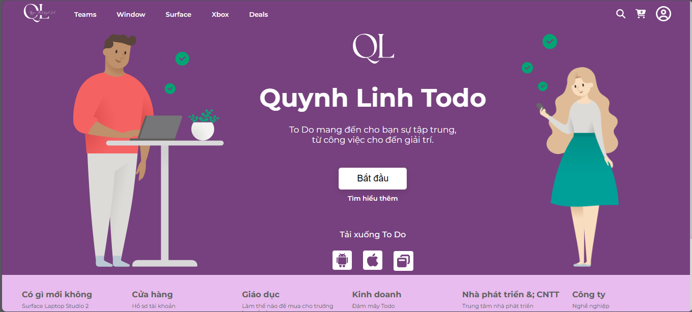
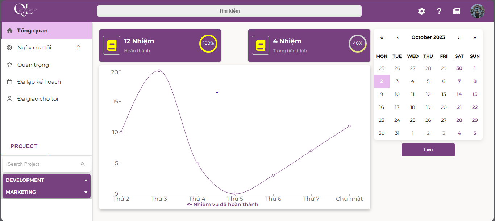
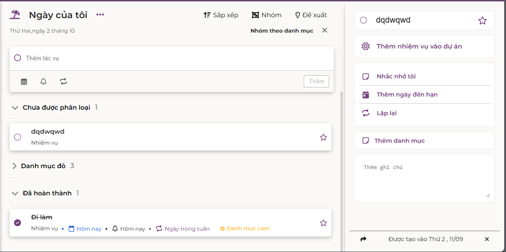

# TODO APP
## Team  Members:
```bash
Saigon University ,Faculty of Information Technology ,Major in Software Engineering
ID          | Full Name
3120410278    Nguyen Thanh Quynh Linh
```
## Project Description:
The application was built to help users take notes on daily work and plan future projects
## Tech Stack Used:
```bash
    * React
    * Scss
    * Redux Toolkit
    ---------------
    * Material UI
    * Fontawesome
    * TippyJs
    
```
## Website Functions:
```bash
   * Login / Register / Logout
   * Allows users to add 1 task (add due date, add notification, add to task category by level)
   * Allows users to edit/delete a job from the list
   * Sort tasks by filter (Filter by completed tasks, by category (Red, Orange, Green) => (High, Medium, Low), unclassified tasks
   * Allows users to reselect recently completed work
```
## [Project Demo Link]([https://www.youtube.com/watch?v=20o8wvX0VQw](https://youtu.be/2TR-u_WX7tU?si=1MO8wxxKaDUzIFDO))
## Some features of the site:
Home Page                   |                   Introduce Page
:---------------------------------:        |      :------------------------------:
  | 

Login Page                   |                   Overview Page
:---------------------------------:        |      :------------------------------:
  | 

Demo                                     
:---------------------------------:        
 
### Make sure to star the repository if you find it helpful!
<a href="https://github.com/Quynh-Linh-IT/To-Do-Note-Application-Website/stargazers"></a>